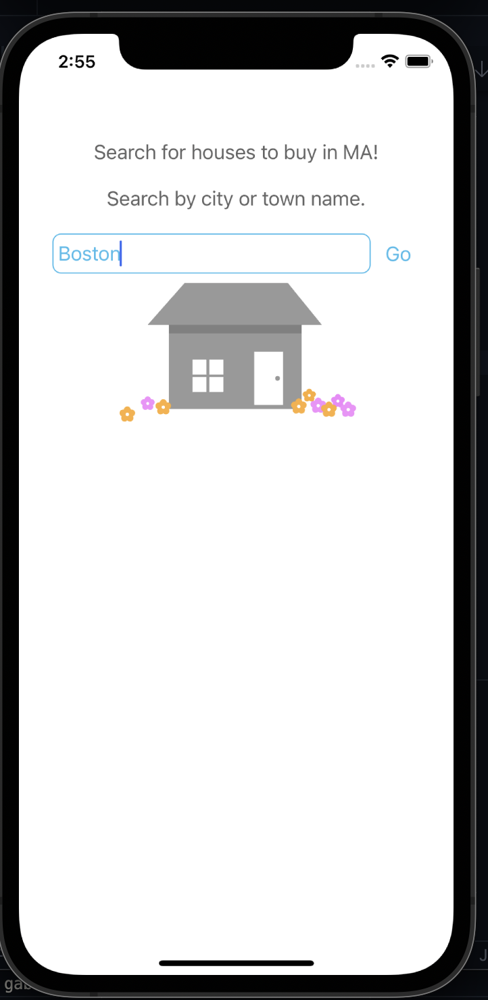
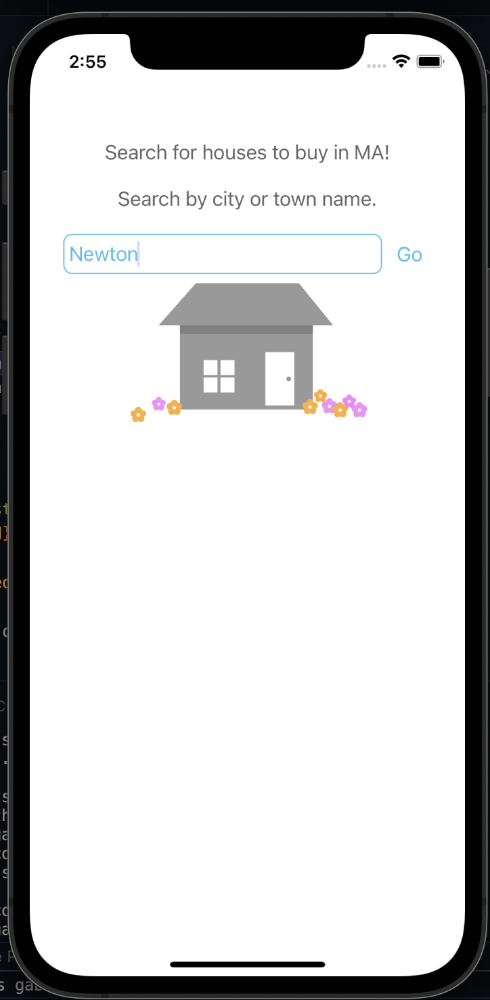

# Hack Technology / Project Attempted

## What you built? 

I attempted to build an ios app using react native that allows users to search for home listings within towns in Massachusetts (my home state). The opening screen has the search term defaulted to "Boston", but the user can input any town or city name. Once fully working, the app should display the top 50 listings (or however many there are) and their addresses, number of bedrooms and bathrooms, square footage, and price.

Include some screenshots.
[How?](https://help.github.com/articles/about-readmes/#relative-links-and-image-paths-in-readme-files)

## Who Did What?

TODO: who worked on what part?

## What you learned

TODO: what worked / what didn't work

## Authors

TODO: list of authors

## Acknowledgments

TODO: cite any tutorials followed here
